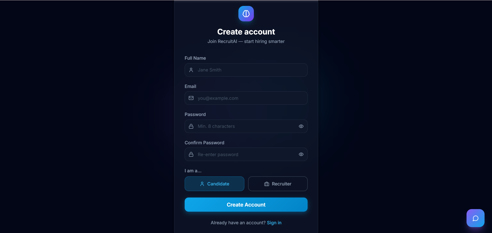

# RecruitAI — AI-Powered Recruitment & Applicant Tracking Platform

[](https://github.com/KeerthanaPothula/ai-resume-analyzer/actions/workflows/backend-ci.yml)
[](https://python.org)
[](https://fastapi.tiangolo.com)
[](https://react.dev)
[](https://typescriptlang.org)
[](https://tailwindcss.com)
[](backend/tests/)
[](LICENSE)

> A production-grade, full-stack AI recruitment platform with ATS resume scoring, semantic candidate ranking, LLM-generated feedback, and a six-stage applicant tracking pipeline — deployed on Render + Vercel.

**Live Demo:** [https://ai-resume-analyzer-nine-peach.vercel.app](https://ai-resume-analyzer-nine-peach.vercel.app)

---

## Table of Contents

1. [Features](#features)
2. [Architecture](#architecture)
3. [Tech Stack](#tech-stack)
4. [Project Structure](#project-structure)
5. [Local Setup](#local-setup)
6. [Running Tests](#running-tests)
7. [Environment Variables](#environment-variables)
8. [Deployment](#deployment)
9. [API Overview](#api-overview)
10. [Screenshots](#screenshots)

---

## Features

### AI & Resume Intelligence
- **Multi-factor ATS scoring** — skill match (40%), experience (20%), education (15%), semantic similarity (25%)
- **Semantic matching** via `sentence-transformers/all-MiniLM-L6-v2` embeddings + cosine similarity
- **LLM feedback** — Google Gemini 2.5 Flash or OpenAI GPT-4o-mini generates gap analysis, strengths, and interview prep questions
- **100+ skill keywords** extracted from unstructured PDF and DOCX resume text using regex + NLP
- **Anti-repetition interview questions** — question history tracked per user; LLM prompted to exclude recent questions
- **AI career coach** — conversational assistant with live resume context

### Applicant Tracking System
- Six-stage pipeline: `Applied → Under Review → Shortlisted → Interview Scheduled → Accepted / Rejected`
- Recruiter status changes sync to candidate dashboard in real time
- Structured interview scheduling — date/time, video link, custom instructions per candidate
- In-app notification system with per-event icons and unread count badge

### Recruiter Tools
- Job management — create, edit, and delete job postings with auto-extracted skill requirements
- Candidate pool browser with ATS score ranking
- One-click bulk AI re-ranking across all applicants, preserving existing recruiter decisions
- Hiring funnel analytics per job

### Security (Production Hardened)
- JWT access + refresh token rotation; silent renewal via Axios interceptor
- Role-based access control: `candidate / recruiter / admin`
- SHA-256 token hashing — plain tokens never persisted to the database
- IP-based rate limiting on all auth and AI endpoints (slowapi)
- `/docs` and `/redoc` disabled unless `DEBUG=True`
- Authenticated file download — resume files are not publicly accessible
- Email verification with 60-second resend cooldown and generic responses to prevent enumeration
- SMTP password reset — 30-minute single-use tokens

---

## Architecture

```
┌──────────────────────────────────────────────────────────────┐
│                    Browser (React SPA)                        │
│   Vercel CDN · React 18 · TypeScript · TanStack Query         │
└──────────────────────┬───────────────────────────────────────┘
                       │  HTTPS / JWT Bearer
                       ▼
┌──────────────────────────────────────────────────────────────┐
│                  FastAPI Backend (Render)                      │
│                                                              │
│  ┌─────────────┐  ┌──────────────┐  ┌───────────────────┐   │
│  │  Auth/RBAC  │  │  API Router  │  │   Rate Limiting   │   │
│  │  JWT + bcrypt│  │  /api/v1/*   │  │   slowapi (IP)    │   │
│  └─────────────┘  └──────┬───────┘  └───────────────────┘   │
│                           │                                   │
│  ┌────────────────────────┼───────────────────────────────┐  │
│  │              Service Layer                              │  │
│  │  ┌──────────────┐  ┌──────────────┐  ┌─────────────┐  │  │
│  │  │ Resume Parser│  │ ATS Scoring  │  │ LLM Service │  │  │
│  │  │ PDF/DOCX→text│  │ Multi-factor │  │ Gemini/GPT  │  │  │
│  │  └──────────────┘  └──────────────┘  └─────────────┘  │  │
│  │  ┌──────────────┐  ┌──────────────┐                    │  │
│  │  │  Embeddings  │  │  Email (SMTP)│                    │  │
│  │  │ MiniLM-L6-v2 │  │    Resend    │                    │  │
│  │  └──────────────┘  └──────────────┘                    │  │
│  └─────────────────────────────────────────────────────────┘  │
│                           │                                   │
│  ┌────────────────────────▼───────────────────────────────┐  │
│  │              SQLAlchemy ORM + Alembic                   │  │
│  └────────────────────────────────────────────────────────┘  │
└──────────────────────────┬───────────────────────────────────┘
                           │
               ┌───────────▼──────────┐
               │  PostgreSQL (Render) │
               │  resumedb            │
               └──────────────────────┘
```

### Request Flow

1. **React SPA** makes API requests to `VITE_API_URL/api/v1/...`
2. **Axios interceptor** attaches `Authorization: Bearer <access_token>` on every request
3. On **401**, the interceptor silently calls `/auth/refresh` (token rotation), queues pending requests, then retries
4. **FastAPI** validates the JWT, fetches the live user role from the database, and enforces RBAC
5. **CPU-bound** work (PDF parsing, embedding generation) is offloaded to `asyncio.to_thread()` to avoid blocking the event loop
6. **Alembic** runs `upgrade head` automatically on container startup before uvicorn begins serving

### Database Schema (key tables)

```
users                        resumes
 ├── id (PK)                  ├── id (PK)
 ├── email (unique)           ├── user_id (FK → users)
 ├── role (enum)              ├── extracted_skills (JSON)
 └── refresh_token_hash       └── embedding (JSON/TEXT)

job_descriptions             candidate_rankings
 ├── id (PK)                  ├── id (PK)
 ├── recruiter_id (FK)        ├── job_id (FK)
 └── embedding (JSON/TEXT)    ├── resume_id (FK)
                              ├── is_applied (bool)
ats_scores                   └── application_status (enum)
 ├── resume_id (FK)
 └── job_id (FK)
```

---

## Tech Stack

| Layer | Technology | Purpose |
|---|---|---|
| Frontend | React 18, TypeScript, Vite | SPA with code-splitting |
| Styling | Tailwind CSS, Framer Motion | Responsive UI + animations |
| State | TanStack Query v5, Zustand | Server state + client state |
| HTTP | Axios | API client with token refresh |
| Backend | Python 3.11+, FastAPI | Async REST API |
| ORM | SQLAlchemy 2, Alembic | Models + migrations |
| Database | SQLite (dev), PostgreSQL 15 (prod) | Persistent storage |
| AI / LLM | Google Gemini 2.5 Flash, OpenAI GPT-4o-mini | Feedback + interview questions |
| Embeddings | sentence-transformers `all-MiniLM-L6-v2` | Semantic similarity |
| Auth | python-jose, passlib/bcrypt, slowapi | JWT + rate limiting |
| Email | Resend API | Verification + password reset |
| Frontend Deploy | Vercel | CDN + SPA routing |
| Backend Deploy | Render (Docker) | Web service + PostgreSQL |

---

## Project Structure

```
ai-resume-platform/
├── backend/
│   ├── app/
│   │   ├── api/v1/endpoints/   # Route handlers (auth, resumes, jobs, …)
│   │   ├── core/               # config.py, security.py, limiter.py
│   │   ├── db/                 # database.py (engine + session factory)
│   │   ├── models/             # SQLAlchemy ORM models
│   │   ├── schemas/            # Pydantic request/response schemas
│   │   └── services/
│   │       ├── ai/             # scoring_engine.py, llm_service.py, skill_extractor.py
│   │       ├── parsers/        # resume_parser.py (PDF + DOCX)
│   │       ├── email.py        # Resend integration
│   │       └── question_history.py
│   ├── alembic/versions/       # Database migrations (8 revisions)
│   ├── scripts/
│   │   └── make_admin.py       # CLI: promote a user to admin role
│   ├── tests/
│   │   ├── conftest.py         # Fixtures: test DB, users, auth headers
│   │   ├── test_auth.py        # 14 auth tests
│   │   ├── test_permissions.py # 11 RBAC tests
│   │   ├── test_resumes.py     # 8 upload + download tests
│   │   └── test_scoring.py     # 12 ATS scoring unit tests
│   ├── Dockerfile
│   ├── requirements.txt        # Production (Docker/Linux)
│   ├── requirements_local.txt  # Local dev (Windows/Mac)
│   └── requirements_test.txt   # Test dependencies
├── frontend/
│   ├── src/
│   │   ├── pages/              # 18 lazy-loaded page components
│   │   ├── components/         # Layout, UI, AIFeedbackPanel, ChatAssistant
│   │   ├── hooks/              # useAuth
│   │   ├── lib/                # api.ts (Axios + token refresh), queryClient.ts
│   │   ├── stores/             # Zustand: themeStore
│   │   └── types/              # TypeScript interfaces
│   ├── Dockerfile              # Multi-stage: Node builder → Nginx runner
│   └── nginx.conf              # SPA fallback rewrite
├── render.yaml                 # Render deployment (backend + PostgreSQL)
├── vercel.json                 # Vercel deployment (frontend)
└── docker-compose.yml          # Local full-stack orchestration
```

---

## Local Setup

**Prerequisites:** Python 3.11+, Node.js 18+

An LLM API key is optional — the platform falls back to template-based responses when `LLM_PROVIDER=none`.

### Backend

```bash
cd backend
python -m venv venv

# Windows
venv\Scripts\activate
# macOS/Linux
source venv/bin/activate

pip install -r requirements_local.txt

# Create your .env file from the template
cp .env.example .env
```

Edit `.env` — the only required field is `SECRET_KEY`:

```bash
# Generate a secure key
python -c "import secrets; print(secrets.token_hex(32))"
```

```bash
# Start the API server
uvicorn app.main:app --reload --port 8000
```

### Frontend

```bash
cd frontend
npm install
npm run dev
```

| Service | URL |
|---|---|
| App | http://localhost:5173 |
| API | http://localhost:8000 |
| API Docs (dev only) | http://localhost:8000/docs |

### Docker Compose (full stack)

```bash
docker-compose up --build
```

This starts PostgreSQL, the backend, and the frontend in one command.

---

## Running Tests

```bash
cd backend
pip install -r requirements_test.txt
python -m pytest tests/ -v
```

Expected output: **45 tests passing** in ~9 seconds.

```
tests/test_auth.py        — 14 tests  (register, login, JWT, refresh, logout)
tests/test_permissions.py — 11 tests  (candidate / recruiter / admin RBAC)
tests/test_resumes.py     —  8 tests  (upload, download, access control)
tests/test_scoring.py     — 12 tests  (ATS scoring, skill extraction, embeddings)
```

The test suite uses:
- An isolated SQLite database (`test_recruitai.db`) created and destroyed per session
- `SECRET_KEY` injected via `os.environ` before any app imports
- `get_db` dependency override for clean session isolation
- `unittest.mock.patch` to stub the CPU-bound PDF analysis pipeline

---

## Environment Variables

### Backend (`backend/.env`)

| Variable | Required | Default | Description |
|---|---|---|---|
| `SECRET_KEY` | **Yes** | — | JWT signing key (min 32 chars). Generate: `python -c "import secrets; print(secrets.token_hex(32))"` |
| `DATABASE_URL` | No | `sqlite:///./resume.db` | SQLite for dev; PostgreSQL for prod |
| `LLM_PROVIDER` | No | `none` | `none`, `gemini`, or `openai` |
| `GEMINI_API_KEY` | If provider=gemini | — | Google AI Studio key |
| `OPENAI_API_KEY` | If provider=openai | — | OpenAI API key |
| `FRONTEND_URL` | No | `http://localhost:5173` | Added to CORS allow-list automatically |
| `ENABLE_EMBEDDINGS` | No | `false` | Set `true` on instances with >1 GB RAM |
| `RESEND_API_KEY` | No | — | Resend API key for email delivery |
| `RESEND_FROM_EMAIL` | No | — | Verified sender address on your Resend domain |
| `DEBUG` | No | `false` | Enables `/docs`, `/redoc`, and debug endpoints |
| `ACCESS_TOKEN_EXPIRE_MINUTES` | No | `60` | Access token lifetime |
| `REFRESH_TOKEN_EXPIRE_DAYS` | No | `7` | Refresh token lifetime |

### Frontend (`frontend/.env`)

| Variable | Required | Description |
|---|---|---|
| `VITE_API_URL` | **Yes (production)** | Backend URL, e.g. `https://your-backend.onrender.com` |

---

## Deployment

### Backend → Render

1. Push to GitHub — Render auto-deploys on `main` pushes (see `render.yaml`)
2. The Docker container runs: `alembic upgrade head && uvicorn app.main:app`
3. Ensure these environment variables are set in the Render dashboard:
   - `SECRET_KEY` (auto-generated by Render)
   - `DATABASE_URL` (auto-injected from the attached PostgreSQL database)
   - `FRONTEND_URL` — your Vercel URL, e.g. `https://my-app.vercel.app`
   - `LLM_PROVIDER` + `GEMINI_API_KEY` (optional)
   - `RESEND_API_KEY` + `RESEND_FROM_EMAIL` (optional)

### Frontend → Vercel

1. Import the repository in Vercel; set **Root Directory** to `frontend`
2. Add environment variable: `VITE_API_URL=https://your-backend.onrender.com`
3. Vercel deploys automatically on every push to `main`

### First Admin Account

The Alembic migration `d4e5f6a7b8c9` promotes the configured email to `admin` on first deploy. To promote a different account, run the bootstrap CLI from the Render Shell (paid plans) or create a new Alembic data migration:

```python
# In a new migration's upgrade():
op.execute("UPDATE users SET role = 'admin' WHERE email = 'you@example.com'")
```

---

## API Overview

All endpoints are prefixed with `/api/v1/`. Authentication uses `Authorization: Bearer <token>`.

### Authentication — `/auth`

| Method | Endpoint | Auth | Description |
|---|---|---|---|
| `POST` | `/register` | Public | Create account; triggers email verification |
| `POST` | `/login` | Public | Returns access + refresh tokens |
| `POST` | `/refresh` | Public | Token rotation; old refresh token is revoked |
| `POST` | `/logout` | Required | Revoke refresh token |
| `GET` | `/me` | Required | Current user profile |
| `POST` | `/forgot-password` | Public | Send reset link (generic response) |
| `POST` | `/reset-password` | Public | Consume reset token, set new password |
| `POST` | `/verify-email` | Public | Verify email address from link |
| `POST` | `/resend-verification` | Public | Resend verification email (60s cooldown) |

### Resumes — `/resumes`

| Method | Endpoint | Auth | Description |
|---|---|---|---|
| `POST` | `/upload` | Candidate | Upload PDF/DOCX; returns full ATS analysis |
| `GET` | `/` | Required | List resumes (own for candidates; all for admin/recruiter) |
| `GET` | `/{id}` | Required | Get resume detail |
| `GET` | `/{id}/file` | Owner / Admin / Recruiter | Download original resume file |
| `DELETE` | `/{id}` | Owner / Admin | Delete resume and all related records |

### Jobs — `/jobs`

| Method | Endpoint | Auth | Description |
|---|---|---|---|
| `POST` | `/` | Recruiter | Create job posting |
| `GET` | `/` | Required | List jobs (own for recruiters; all for others) |
| `GET` | `/{id}` | Required | Get job detail |
| `PUT` | `/{id}` | Owner / Admin | Update job |
| `DELETE` | `/{id}` | Owner / Admin | Delete job and related records |

### Applications — `/applications`

| Method | Endpoint | Auth | Description |
|---|---|---|---|
| `POST` | `/apply` | Candidate | Apply to a job with a resume |

### Rankings — `/rankings`

| Method | Endpoint | Auth | Description |
|---|---|---|---|
| `POST` | `/rank/{job_id}` | Recruiter | Re-rank applicants by ATS score |
| `GET` | `/job/{job_id}` | Recruiter (owner) | Get ranked applicants for a job |
| `GET` | `/my-applications` | Candidate | Candidate's application statuses |
| `PATCH` | `/{ranking_id}` | Recruiter (owner) | Update status, notes, interview details |

### AI Feedback — `/ai-feedback` *(10/min rate limit)*

| Method | Endpoint | Auth | Description |
|---|---|---|---|
| `GET` | `/status` | Required | LLM provider availability check |
| `POST` | `/resume/{id}` | Required | Generate resume-specific AI feedback |
| `POST` | `/resume/{id}/job/{jid}` | Required | Job-match feedback + interview questions |
| `POST` | `/quick-match` | Required | Instant job-match without a saved job |
| `POST` | `/chat` | Required | AI career coaching conversation |

### Dashboard — `/dashboard`

| Method | Endpoint | Auth | Description |
|---|---|---|---|
| `GET` | `/candidate` | Candidate | Stats: resume count, best score, top skills |
| `GET` | `/recruiter` | Recruiter | Stats: job count, hiring funnel KPIs |

### Notifications — `/notifications`

| Method | Endpoint | Auth | Description |
|---|---|---|---|
| `GET` | `/` | Required | Notification feed |
| `GET` | `/unread-count` | Required | Badge count |
| `POST` | `/{id}/read` | Required | Mark single notification read |
| `POST` | `/read-all` | Required | Mark all notifications read |

---

## Screenshots

### Landing Page


### Authentication


### Candidate Dashboard


### Resume Analysis


### AI Feedback


---

## License

MIT — free to use, modify, and distribute.
