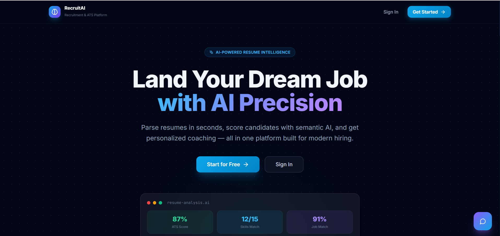
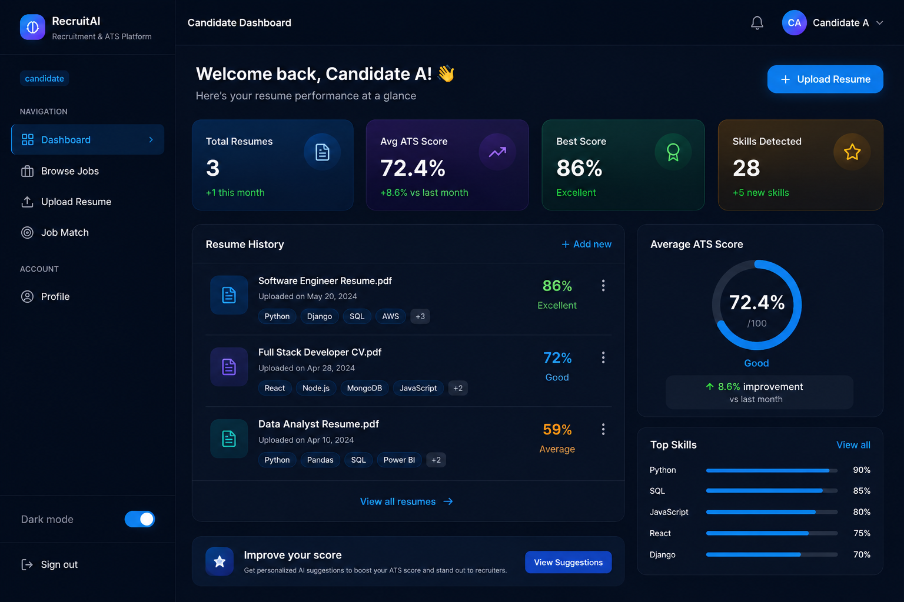
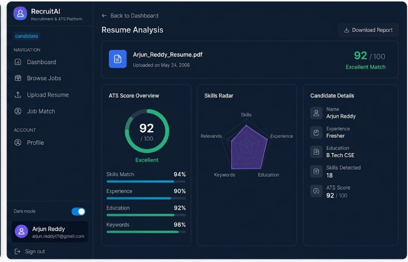
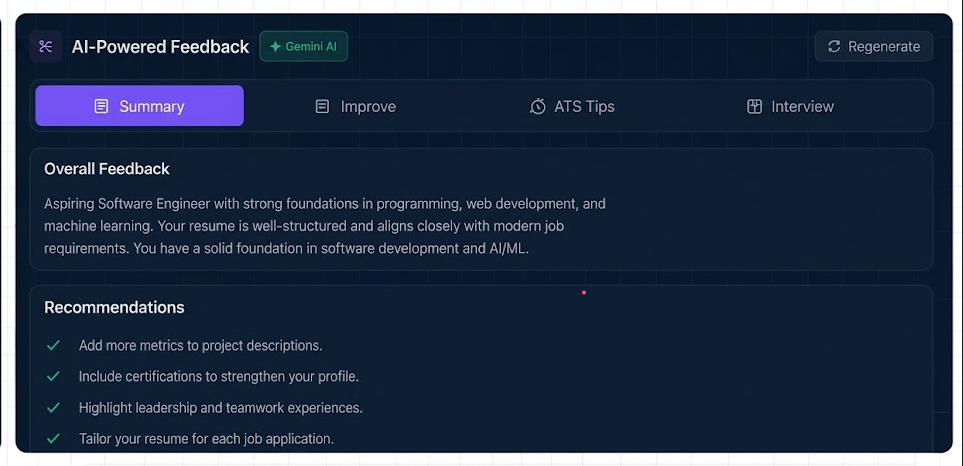

# RecruitAI — AI-Powered Recruitment Platform

> Full-stack SaaS that replaces spreadsheet hiring with AI-scored resumes, semantic candidate ranking, LLM-generated feedback, and a six-stage applicant tracking pipeline.

[](https://github.com/KeerthanaPothula/ai-resume-analyzer/actions/workflows/backend-ci.yml)
[](backend/tests/)
[](https://python.org)
[](https://fastapi.tiangolo.com)
[](https://react.dev)
[](https://typescriptlang.org)
[](LICENSE)

**[Live Demo](https://ai-resume-analyzer-nine-peach.vercel.app)** · **[API Docs](https://ai-resume-analyzer-nine-peach.vercel.app)** (dev: `localhost:8000/docs`)

**Stack:** FastAPI · React · TypeScript · PostgreSQL · Docker · GitHub Actions · Google Gemini · OpenAI

---

## Project Highlights

- **AI ATS Resume Scoring** — multi-factor scoring: skill match (40%), experience (20%), education (15%), semantic similarity (25%)
- **Semantic Candidate Matching** — `sentence-transformers/all-MiniLM-L6-v2` embeddings + cosine similarity
- **AI Interview Question Generation** — 120+ question bank; LLM generates role-specific, non-repeating questions
- **Three-role RBAC** — Candidate, Recruiter, Admin with JWT + refresh token rotation
- **Six-stage Hiring Pipeline** — Applied → Under Review → Shortlisted → Interview Scheduled → Accepted/Rejected
- **GitHub Actions CI/CD** — 45 automated tests gate every push
- **Docker Deployment** — Render (backend + PostgreSQL) + Vercel (frontend)

| Metric | Value |
|---|---|
| Automated Tests | 45 (pytest) |
| Interview Questions | 120+ in question bank |
| Skills Extracted | 100+ keywords |
| Hiring Pipeline Stages | 6 |
| API Endpoints | 30+ |
| Database | PostgreSQL (production) |

---

## Why RecruitAI?

Traditional hiring workflows rely on keyword-matching ATS systems that reject qualified candidates and overwhelm recruiters with unranked applications.

**RecruitAI solves this in three layers:**

1. **Smarter scoring** — beyond keyword counts. Semantic embeddings capture candidates who describe skills differently; experience and education factors prevent over-penalizing career-changers.
2. **AI feedback that improves candidates** — instead of a black-box rejection, candidates receive specific gap analysis, improvement suggestions, and targeted interview prep generated by Gemini or GPT-4o.
3. **Recruiter workflow** — one-click AI re-ranking, structured interview scheduling (date + video link + custom instructions), status changes that notify candidates automatically.

---

## Features

### Candidate Features
- Upload PDF or DOCX resumes; analysis runs automatically on upload
- View multi-factor ATS scores with matched/missing skills breakdown
- Generate AI feedback: gap analysis, ATS optimization tips, strengths
- Job-match analysis: compare any resume against any posting
- AI career coaching chat with live resume context
- Application tracking: see status changes and interview details in real time

### Recruiter Features
- Create, edit, and delete job postings with auto-extracted skill requirements
- Browse ranked candidate pool with ATS scores
- One-click bulk AI re-ranking, preserving existing shortlist decisions
- Schedule interviews: date/time, video link, custom instructions per candidate
- Hiring funnel analytics per job posting

### Admin Features
- View all users, resumes, and job postings across the platform
- Promote users to admin or recruiter roles
- System-wide analytics dashboard

### AI Features
- **Semantic search** — vector embeddings for resume/job similarity (cosine)
- **Skill extraction** — 100+ keyword regex + NLP pipeline from unstructured PDF/DOCX
- **Multi-factor ATS scoring** — weighted composite score (skill 40%, exp 20%, edu 15%, semantic 25%)
- **AI career coach** — conversational assistant powered by Gemini 2.5 Flash or GPT-4o-mini
- **Interview question generation** — behavioral, technical, situational; anti-repetition via per-user question history

### Security Features
- JWT access + refresh token rotation; silent renewal via Axios interceptor
- SHA-256 token hashing — plain tokens never written to the database
- IP-based rate limiting on all auth and AI endpoints (slowapi)
- Role-based access control enforced on every endpoint
- Authenticated file download — resume files are never publicly accessible
- `/docs` and `/redoc` disabled in production (`DEBUG=False`)
- Email verification with 60-second resend cooldown and generic responses (prevents enumeration)

---

## Screenshots

### Landing Page


### Candidate Dashboard


### Resume Analysis


### AI Feedback


---

## Technical Skills Demonstrated

**Backend**
- REST API design with FastAPI; async endpoints; dependency injection
- SQLAlchemy 2 ORM with Alembic migrations (8 revisions, versioned chain)
- JWT authentication: access tokens + refresh rotation + SHA-256 hashing
- Background task offloading via `asyncio.to_thread()` for CPU-bound work
- Rate limiting, RBAC, and authenticated static file delivery

**Frontend**
- React 18 + TypeScript with lazy-loaded routes (18 pages)
- TanStack Query v5 for server state; Zustand for client state
- Axios interceptor for transparent token refresh and request queuing
- Tailwind CSS + Framer Motion for responsive, animated UI

**Database**
- PostgreSQL in production; SQLite for local dev and test isolation
- Composite indexes on high-frequency FK columns (7 performance indexes)
- N+1 query elimination via bulk `IN` queries + Python dict lookups

**AI / ML**
- Sentence-transformers (`all-MiniLM-L6-v2`) for semantic embeddings
- Cosine similarity ranking with scikit-learn
- Multi-provider LLM integration: Google Gemini 2.5 Flash, OpenAI GPT-4o-mini, template fallback
- Regex + NLP skill extraction pipeline over unstructured resume text

**DevOps**
- Docker multi-stage builds (Node builder → Nginx runner for frontend)
- Docker Compose for local full-stack orchestration
- GitHub Actions CI: pytest (45 tests) + flake8 lint on every push
- Render deployment via `render.yaml`; Vercel via `vercel.json`
- Alembic `upgrade head` runs automatically at container startup

---

## Architecture

```
┌──────────────────────────────────────────────────────────────┐
│                    Browser (React SPA)                        │
│   Vercel CDN · React 18 · TypeScript · TanStack Query         │
└──────────────────────┬───────────────────────────────────────┘
                       │  HTTPS / JWT Bearer
                       ▼
┌──────────────────────────────────────────────────────────────┐
│                  FastAPI Backend (Render)                      │
│  ┌─────────────┐  ┌──────────────┐  ┌───────────────────┐   │
│  │  Auth/RBAC  │  │  API Router  │  │   Rate Limiting   │   │
│  │ JWT + bcrypt │  │  /api/v1/*   │  │   slowapi (IP)    │   │
│  └─────────────┘  └──────┬───────┘  └───────────────────┘   │
│  ┌────────────────────────┼───────────────────────────────┐  │
│  │  ┌──────────────┐  ┌──────────────┐  ┌─────────────┐  │  │
│  │  │ Resume Parser│  │ ATS Scoring  │  │ LLM Service │  │  │
│  │  │ PDF/DOCX→text│  │ Multi-factor │  │ Gemini/GPT  │  │  │
│  │  └──────────────┘  └──────────────┘  └─────────────┘  │  │
│  │  ┌──────────────┐  ┌──────────────┐                    │  │
│  │  │  Embeddings  │  │  Email       │                    │  │
│  │  │ MiniLM-L6-v2 │  │    Resend    │                    │  │
│  │  └──────────────┘  └──────────────┘                    │  │
│  └─────────────────────────────────────────────────────────┘  │
│  ┌────────────────────────────────────────────────────────┐   │
│  │         SQLAlchemy ORM + Alembic migrations             │   │
│  └────────────────────────────────────────────────────────┘   │
└──────────────────────────┬───────────────────────────────────┘
                           │
               ┌───────────▼──────────┐
               │  PostgreSQL (Render) │
               └──────────────────────┘
```

**Request flow:**
1. React SPA → `VITE_API_URL/api/v1/...` with `Authorization: Bearer <token>`
2. On 401, Axios interceptor silently refreshes token, queues pending requests, retries
3. FastAPI validates JWT, fetches live user role from DB, enforces RBAC
4. CPU-bound work (PDF parsing, embeddings) runs in `asyncio.to_thread()` — event loop never blocked
5. Alembic runs `upgrade head` at container startup before uvicorn serves traffic

---

## Project Structure

```
ai-resume-platform/
├── backend/
│   ├── app/
│   │   ├── api/v1/endpoints/   # Route handlers (auth, resumes, jobs, rankings, …)
│   │   ├── core/               # config.py, security.py, limiter.py
│   │   ├── models/             # SQLAlchemy ORM models
│   │   ├── schemas/            # Pydantic request/response schemas
│   │   └── services/
│   │       ├── ai/             # scoring_engine.py, llm_service.py, skill_extractor.py
│   │       └── parsers/        # resume_parser.py (PDF + DOCX)
│   ├── alembic/versions/       # 8 versioned migrations
│   ├── tests/                  # 45 tests across 4 files
│   ├── Dockerfile
│   └── requirements*.txt
├── frontend/
│   ├── src/
│   │   ├── pages/              # 18 lazy-loaded page components
│   │   ├── components/         # Layout, UI, AIFeedbackPanel, ChatAssistant
│   │   └── lib/                # api.ts (Axios + token refresh)
│   ├── Dockerfile              # Multi-stage: Node builder → Nginx runner
│   └── nginx.conf
├── .github/workflows/
│   └── backend-ci.yml          # CI: pytest + flake8 on every push
├── render.yaml                 # Render deployment config
├── vercel.json                 # Vercel deployment config
└── docker-compose.yml          # Local full-stack orchestration
```

---

## Local Setup

**Prerequisites:** Python 3.11+, Node.js 18+

> LLM API key is optional — set `LLM_PROVIDER=none` for template-based responses.

### Backend

```bash
cd backend
python -m venv venv
source venv/bin/activate      # Windows: venv\Scripts\activate
pip install -r requirements_local.txt
cp .env.example .env
# Edit .env — generate SECRET_KEY:
python -c "import secrets; print(secrets.token_hex(32))"
uvicorn app.main:app --reload --port 8000
```

### Frontend

```bash
cd frontend
npm install
npm run dev
```

| Service | URL |
|---|---|
| App | http://localhost:5173 |
| API | http://localhost:8000 |
| API Docs (dev only) | http://localhost:8000/docs |

### Docker Compose (full stack)

```bash
docker-compose up --build
```

---

## Running Tests

```bash
cd backend
pip install -r requirements_test.txt
python -m pytest tests/ -v
```

**45 tests passing in ~9 seconds.**

```
test_auth.py        14 tests  (register, login, JWT, refresh rotation, logout)
test_permissions.py 11 tests  (candidate / recruiter / admin RBAC boundaries)
test_resumes.py      8 tests  (upload, download, authenticated access control)
test_scoring.py     12 tests  (ATS scoring, skill extraction, embedding disable)
```

Test infrastructure: isolated SQLite DB per session, `get_db` override for session isolation, `unittest.mock.patch` to stub the PDF analysis pipeline, env vars injected before pydantic-settings instantiation.

---

## Environment Variables

### Backend (`backend/.env`)

| Variable | Required | Default | Description |
|---|---|---|---|
| `SECRET_KEY` | **Yes** | — | JWT signing key. Generate: `python -c "import secrets; print(secrets.token_hex(32))"` |
| `DATABASE_URL` | No | `sqlite:///./resume.db` | SQLite for dev; PostgreSQL for prod |
| `LLM_PROVIDER` | No | `none` | `none`, `gemini`, or `openai` |
| `GEMINI_API_KEY` | If gemini | — | Google AI Studio key |
| `OPENAI_API_KEY` | If openai | — | OpenAI API key |
| `FRONTEND_URL` | No | `http://localhost:5173` | Added to CORS allow-list |
| `ENABLE_EMBEDDINGS` | No | `false` | Set `true` on instances with >1 GB RAM |
| `RESEND_API_KEY` | No | — | Email delivery (Resend) |
| `DEBUG` | No | `false` | Enables `/docs` and `/redoc` |

### Frontend (`frontend/.env`)

| Variable | Required | Description |
|---|---|---|
| `VITE_API_URL` | **Yes (prod)** | Backend URL, e.g. `https://your-backend.onrender.com` |

---

## Deployment

### Backend → Render

1. Push to `main` — Render auto-deploys via `render.yaml`
2. Container runs: `alembic upgrade head && uvicorn app.main:app`
3. Set in Render dashboard: `SECRET_KEY`, `DATABASE_URL` (auto-injected), `FRONTEND_URL`, `LLM_PROVIDER` + API key (optional), `RESEND_API_KEY` (optional)

### Frontend → Vercel

1. Import repo in Vercel; set **Root Directory** to `frontend`
2. Add `VITE_API_URL=https://your-backend.onrender.com`
3. Vercel deploys automatically on every push to `main`

---

## API Documentation

> Development docs: **http://localhost:8000/docs** (disabled in production)

| Group | Base Path | Description |
|---|---|---|
| Authentication | `/api/v1/auth` | Register, login, refresh, logout, email verify, password reset |
| Resumes | `/api/v1/resumes` | Upload, list, download (authenticated), delete |
| Jobs | `/api/v1/jobs` | Create, list, update, delete job postings |
| Applications | `/api/v1/applications` | Apply to jobs |
| Rankings | `/api/v1/rankings` | AI re-rank, get ranked candidates, update status |
| AI Feedback | `/api/v1/ai-feedback` | Resume feedback, job-match analysis, career chat *(10 req/min)* |
| Dashboard | `/api/v1/dashboard` | Candidate and recruiter analytics |
| Notifications | `/api/v1/notifications` | Feed, unread count, mark read |

All endpoints require `Authorization: Bearer <token>` except public auth routes.

---

## Future Improvements

- **Vector Database Integration** — migrate embeddings to pgvector or Pinecone for sub-millisecond semantic search at scale
- **RAG-based Candidate Search** — retrieval-augmented generation over the full candidate pool
- **Multi-Agent Recruiting Assistant** — specialized agents for screening, scheduling, and offer negotiation
- **LLM-powered Resume Parsing** — replace regex pipeline with structured LLM extraction for higher accuracy
- **Real-time Interview Copilot** — live transcription + in-ear coaching suggestions during video interviews

---

## License

MIT — free to use, modify, and distribute.
